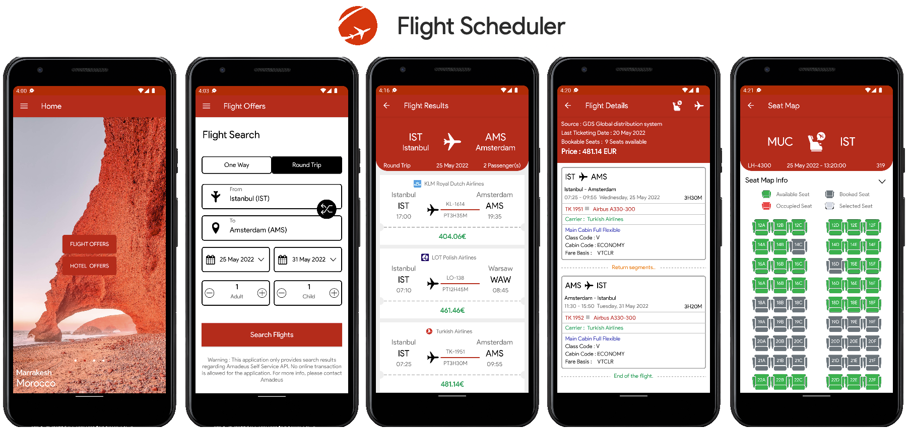

# Flight Scheduler ✈️

## Built With 🛠
- [Kotlin](https://kotlinlang.org/) - First class and official programming language for Android development.
- [Coroutines](https://kotlinlang.org/docs/reference/coroutines-overview.html) - For asynchronous and more..
- [Jetpack Compose](https://developer.android.com/jetpack/compose) - Android’s modern toolkit for building native UI.
- [Android Architecture Components](https://developer.android.com/topic/libraries/architecture) - Collection of libraries that help you design robust, testable, and maintainable apps.
  - [LiveData](https://developer.android.com/topic/libraries/architecture/livedata) - Data objects that notify views when the underlying database changes.
  - [ViewModel](https://developer.android.com/topic/libraries/architecture/viewmodel) - Stores UI-related data that isn't destroyed on UI changes. 
  - [ViewBinding](https://developer.android.com/topic/libraries/view-binding) - Generates a binding class for each XML layout file present in that module and allows you to more easily write code that interacts with views.
  - [Room](https://developer.android.com/topic/libraries/architecture/room) - SQLite object mapping library.
- [Dependency Injection](https://developer.android.com/training/dependency-injection) - 
  - [Hilt-Dagger](https://dagger.dev/hilt/) - Standard library to incorporate Dagger dependency injection into an Android application.
  - [Hilt-ViewModel](https://developer.android.com/training/dependency-injection/hilt-jetpack) - DI for injecting `ViewModel`.
- [Glide](https://github.com/bumptech/glide) - A type-safe HTTP client for Android and Java.
- [Moshi](https://github.com/square/moshi) - A modern JSON library for Kotlin and Java.
- [Moshi Converter](https://github.com/square/retrofit/tree/master/retrofit-converters/moshi) - A Converter which uses Moshi for serialization to and from JSON.
- [Material Components for Android](https://github.com/material-components/material-components-android) - Modular and customizable Material Design UI components for Android.

# Package Structure
    
    com.java.flightscheduler    # Root Package
    .
    ├── data                # For data handling.
    │   ├── local           # Local Persistence Database. Room (SQLite) database
    |   │   ├── dao         # Data Access Object for Room   
    │   ├── remote          # Remote Data Handlers     
    |   │   ├── api         # Retrofit API for remote end point.
    │   └── repository      # Single source of data.
    |
    ├── model               # Model classes
    |
    ├── di                  # Dependency Injection             
    │   ├── builder         # Activity Builder
    │   ├── component       # DI Components       
    │   └── module          # DI Modules
    |
    ├── ui                  # Activity/View layer
    │   ├── base            # Base View
    │   ├── main            # Main Screen Activity & ViewModel
    |   │   ├── adapter     # Adapter for RecyclerView
    |   │   └── viewmodel   # ViewHolder for RecyclerView   
    │   └── prediction      # Delay Prediction of Flights
    │   └── flight          # Flight offers and it's details
    │   └── hotel           # Hotel offers and it's details
    │   └── metrics         # Itinerary price metrics for past flights
    │   └── seatmap         # Seatmap
    |
    └── utils               # Utility Classes / Kotlin extensions

## Setup
All test cases are located in androidTest package, during the test implementation, dependency injection is being handled by Hilt
In order to run test cases, Virtual device (Emulator) or Physical device needs to be connected.

## Architecture
This app uses [***MVVM (Model View View-Model)***](https://developer.android.com/jetpack/docs/guide#recommended-app-arch) architecture.

## TODO
* Preferences option
* Itinerary metrics visualisation
